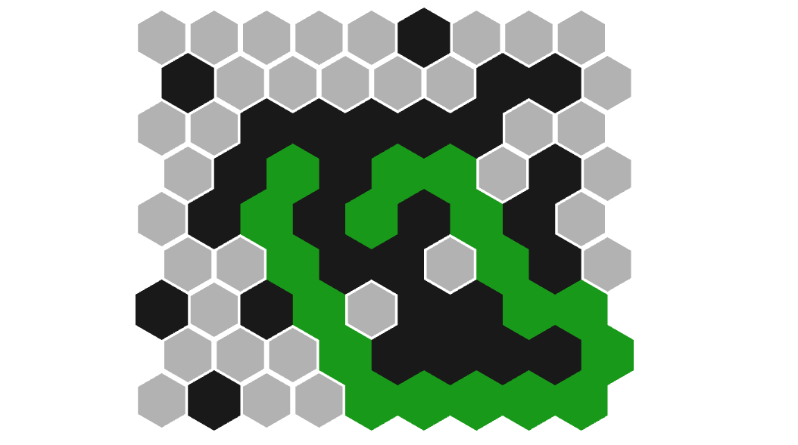

# Hexagonal Grid

**Keywords:** Grids, Hexagons, Procedural, WebGL2

This demo demonstrates procedural generation and rendering of hexagonal grids in WebGL2. Hexagonal grids are widely used in strategy games, board games, and data visualization due to their uniform neighbor distances.

This example shows efficient hex grid generation, coordinate systems, and rendering techniques. It's ideal for implementing tile-based game systems or geographic visualizations.

**[How to run](../how_to_run.md)**

**References:**

* [Red Blob Games - Hex Grids] - Comprehensive hex grid theory
* [A* Pathfinding] - Pathfinding algorithm explanation
* [WebGL Fundamentals] - WebGL rendering basics
* [Tiles Tools Documentation] - Core hex grid library

[Red Blob Games - Hex Grids]: https://www.redblobgames.com/grids/hexagons/
[A* Pathfinding]: https://www.redblobgames.com/pathfinding/a-star/
[WebGL Fundamentals]: https://webglfundamentals.org/
[Tiles Tools Documentation]: ../../../module/helper/tiles_tools/readme.md
