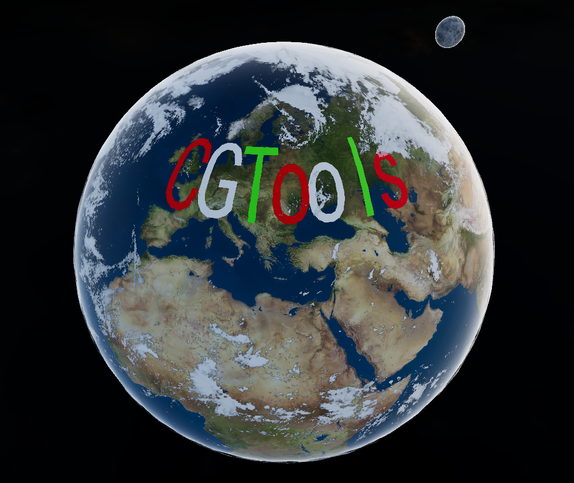

# Text surface rendering

This example demonstrates how to render a 2d text on surface like sphere utilizing the `web_sys`, `minwebgl`, `renderer`, `canvas_renderer` crates.



## How it is useful

The example showcases several useful techniques and concepts:

  * How create main scene for rendering by `renderer::Renderer`.
  * How use `renderer::Renderer` and `renderer::SwapFramebuffer`.
  * How create canvas scene with text for rendering by `canvas_renderer::CanvasRenderer`.
  * How use `canvas_renderer::CanvasRenderer`.
  * How connect main scene object materials with `canvas_renderer::CanvasRenderer` rendered result texture.
  * How set start state of `Camera` and make `Camera` static.

## How it works

1. **Setup main scene and camera**.

Load or create GLTF with scenes and choose scene to render. Set camera state and bind input to camera's controls.

2. **Setup canvas scene and camera**.

Load or create GLTF with scenes and choose scene to render. There is can be added text or curve geometry.

3. **Connect canvas renderer output texture with base texture of any 3d object from main scene**.

4. **Call CanvasRenderer::render**.

5. **Call Renderer::render**.

## Running

Make sure you have installed all the necessary dependencies. This example requires `trunk` for building and serving the WebAssembly application.

In order to run the example:

1. Navigate to the example's directory in your terminal.

2. Run the command:

``` bash
  trunk serve
```

3. Open your web browser to the address provided by trunk (usually http://127.0.0.1:8080).

The application will load the GLTF model, compile and link shaders, set up WebGL resources, and start the rendering loop, displaying the 3D object with rendered text on its surface.

If you want you can:
  1. Use a different 3D model for rendering to its surface, replace the `sphere.glb` with any gltf file from `assets/gltf` folder. 
  2. Experiment with canvas scene layout by adding/removing text and changing its transform.
  3. Change canvas renderer camera state.