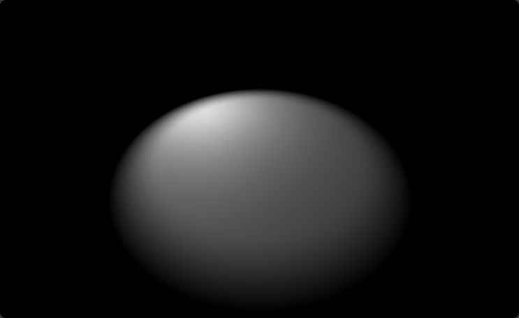
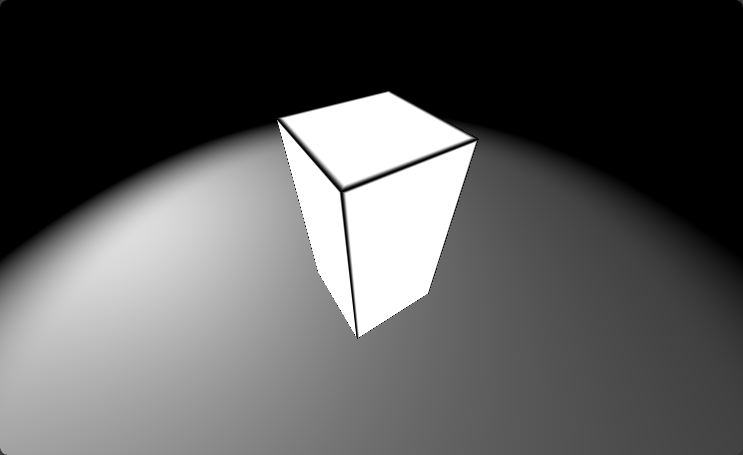

### Basic setup
We are going to create our custom shaders based on this shader [Cube lines Shader]. I'm going to do this using WebGPU as my backend, and WGSL as a shader language. Skipping the setup explanation, in my shader I'm going to have the following uniform variables:

```rust
struct Uniforms
{
  eye : vec3f,          // Position of the camera
  view_dir: vec3f,      // Camera's view direction
  up : vec3f,           // Cumera's orientation
  resolution : vec2f,   // Resolution of the screen
  time : f32            // Total time passed
}
```
Camera control logic happens outside of the shader, so I can just use camera's information as it is in the shader.
 
Now with the shader. First we need to generate our rays. For this we need to have a ray origin( `ro` ), which is going to be our camera's position, and a ray direction( `rd` ), which we are going to calculate ourselves. The idea is to generate them in simple to calculate coordinates, and then to rotate them to match the view direction and orientation of the camera.  

We are going to place our origin at ( 0.0, 0.0, 0.0 ) and shoot ray in +Z direction. The X and Y coordinates will be decided from the fragment posiiton on the screen:

```rust
var rd = vec3f( ( in.pos.xy * 2.0 - u.resolution ) / u.resolution.x, 0.7 );
rd.y *= -1.0;
```

We shift a fragment position to be centered at the  origin( [ 0.0, 0.0 ]), and then we normalize them by the width of the screen. This way we are going to have uniform speed across X and Y axis, when we move our camera. Z value define FOV ofthe camera - the bigger it is, the more zoomed in the view will be. We flip the Y axis, because fragment coordinates start at left-upper corner, and we need it to start at the left-bottom corner.

Now we need to define the camera's coordinate system, whose unit vectors will define the rotation that we need to perform on our rays:

```rust
// Orthonormal vectors of the view transformation
let vz = normalize( u.view_dir );
var vy = normalize( u.up );
let vx = normalize( cross( vz, vy ) );
vy = normalize( cross( vx, vz ) );
let m = mat3x3( vx, vy, vz );
```

In camera's coordinate system, Z axis will point in the `view` direction, Y axis in the `Up` direction, and X axis will be perpendicular to the Y and Z. We normalize all vectors to be sure they are `1` in length.   

Now we apply camera's rotation to our rays:

```rust
rd = normalize( m * rd );
```

An intuitive explanation, as to how this rotation work is we assume are rays are defined in camera's local coordinate system. What we need is to find the coordinates of our rays in the world space. Orthonormal vectors, that define camera's coordinate system, are all defined in world space coordinates. So to find, for example, the X coordinate of our ray in the world space, we just need to find the contribution of each if its components( defined in local spcae ) to the X coordinate in the world space. We multiply each component by the X value of its corresponding orthonormal vector and sum them together getting the X coordinate in the world space for our vector. Other axises are done in the same way.

Here are a few resources to help with understanding:
- [Fundamentals of Computer Graphics]
- [Confused with Coordinate Transformations] 
- [Computer Graphics Chapter – 7 (part - B)]

### Background

To draw a plane, we need to find the point of intersection between our ray and the plane. The formula can be derived analitically and translated directly to code:

```rust
fn raytrace_plane
( 
  ro_in : vec3f, // Ray origin
  rd_in : vec3f, // Ray direction
  normal : vec3f, // Normal of the plane
  p0 : vec3f // Any point on the plane
) -> f32
{
  // If this equals 0.0, then the line is parallel to the plane
  let RdotN = dot( rd_in, normal );
  if RdotN == 0.0 { return -1.0; }

  let t = dot( ( p0 - ro_in ), normal ) / RdotN;
  return t;
}
```
Links:
- [Line-plane intersection]
- [Intersectors]

Then we call it like this:
```rust
let plane_t = raytrace_plane( ro_in, rd_in, plane_normal, p0 );
```

If `plane_t` is bigger than 0.0, then we got a hit in a positive direction of our ray.
We will limit the size of our plane, by only drawing if X and Z coordinates are in certain bounds:
```rust
fn draw_background
(
  ro_in : vec3f,
  rd_in : vec3f,
  light_source : vec3f
) -> vec3f
{
  let plane_size = 6.0;
  let plane_hit = ro_in + plane_t * rd_in;
  let uv = abs( plane_hit.xz );
  if all( uv <= vec2f( plane_size ) )
  {
    // Color the plane
    // ...
  }
  // ...
]
```

The light will be a point light, and it will have light attenuation based on the distance from the light. We will use a simple [Bling-Phong reflection model]:
```rust
// Calculate the distance to the light source
let r = length( light_source - plane_hit ); 
// Attenuation of the light, that can be controlled by the `LIGHT_POWER` constant
let attenuation = LIGHT_POWER / ( r * r );

// Direction to the light source
let light_dir = normalize( light_source - plane_hit );
let LdotN = saturate( dot( light_dir, plane_normal ) );
// Half vector between the view direction and the light direction
let H = normalize( light_dir - rd_in );
// Adds a specular reflection
let phong_value = pow( saturate( dot( plane_normal, H ) ), 16.0 ) * 0.1;

// Diffuse color of the plane
var diff_color = vec3f( 1.0 );
// Apply lighting 
var plane_color = ( LdotN * diff_color + phong_value );
// Reduce by the attenuation
plane_color *= attenuation;
```

We also will smooth out the edges of the plane, to make it look like a disk that slowly fades away:
```rust
let blur_radius = 5.0;
// ...
final_color = mix
( 
  plane_color, 
  final_color, 
  smoothstep
  ( 
    blur_radius - 1.5,
    blur_radius,
    length( uv )
  ) 
);
```

I decided to use [Gamma correction] on the background only, which is usually done for the final color of the scene. The reason for the is because the plane looks nicer, but everything else isn't:

```rust
return pow( final_color, vec3f( 1.0 / 2.2 ) );
```

<p align="center">

</p>

### Box

Again we are goin to use an analitically derived intersection between the ray and an axis aligned box from here [Intersectors]. The function below is slightli modified and is taken from the [Strange Crystal Shader], with a little explanation from me.
```rust
fn raytrace_box
(
  ro : vec3f, 
  rd : vec3f, 
  normal : ptr< function, vec3f >, // Normal at the hit point
  box_dimension : vec3f,
  entering : bool
)  -> f32
{
  // Having an equation ro + t * rd, we calculate an intersection `t` with 3 planes : xy, xz, and yz.
  // we calculate `t`, such that our ray hits the planes xy, xz, yz.
  // The result for each plane is stored in z, y, x coordinates of the `t` variable respectively.
  let dr = 1.0 / rd;
  let t = ro * dr;
  // Now we need to offset the `t` to hit planes that build the box.
  // If we take a point in the corner of the box and calculate the distance needed to travel from that corner
  // to all three planes, we can then take that distance and subtruct/add to our `t`, to get the proper hit value.
  let dt = box_dimension * abs( dr );
  
  // Planes facing us are closer, so we need to subtruct
  let pin = - dt - t;
  // Planes behind the front planes are farther, so we need to add
  let pout =  dt - t;

  // From the distances to all the front and back faces, we find faces of the box that are actually hit by the ray
  let tin = max( pin.x, max( pin.y, pin.z ) );
  let tout = min( pout.x, min( pout.y, pout.z ) );

  // Ray is outside of the box
  if tin > tout
  { 
    return -1.0;
  }

  // Calculate the normal
  if entering
  {
    *normal = -sign( rd ) * step( pin.zxy, pin.xyz ) * step( pin.yzx, pin.xyz );
  } 
  else 
  {
    *normal = sign (rd ) * step( pout.xyz, pout.zxy ) * step( pout.xyz, pout.yzx );
  }

  return select( tout, tin, entering );
}
```

Back to the `fs_main` function, we find the intersection with the box and color it if there was a hit:
```rust
var box_normal : vec3f;
let box_t = raytrace_box( ro, rd, &box_normal, BOX_DIMENSIONS, true );

if box_t > 0.0
{
  final_color = vec3f( 0.0 );
  // Intersection point on the box
  var ro = ro + box_t * rd;

  // Color Here
}
```

At the edges we are going to add a dark smooth stitch to cover the transition between the sides:
```rust
const BOX_DIMENSIONS : vec3f = vec3f( 0.5, 1.0, 0.5 );
// Distance to the edges
const BOX_DTE : vec3f = vec3f
( 
  length( BOX_DIMENSIONS.xz ), 
  length( BOX_DIMENSIONS.xy ), 
  length( BOX_DIMENSIONS.yz ) 
);

// Paint the edges in black with a little blur at transition
fn smooth_box_edge( ro : vec3f ) -> f32
{
  let edge_blur = smoothstep
  ( 
    BOX_DTE - vec3f( 0.02 ), 
    BOX_DTE, 
    vec3f( length( ro.xz ), length( ro.xy ), length( ro.yz ) ) 
  );

  return max( edge_blur.x, max( edge_blur.y, edge_blur.z ) );
}
```

Box is symmetrical and is centered at the origin, so we can store the distance to the edges( three of them ) in `BOX_DTE` constant. The function then applies a smoothstep some dinstance away form the edge and towards the edge, depending on the current distance of the hit point. We then return the maximum across all three edges, to only cover the closest edge.

Add the color in the main function
```rust
const BOX_EDGE_COLOR : vec3f = vec3f( 0.0 );
// ...

if box_t > 0.0
{
  // ...
  let edge_t = smooth_box_edge( ro );
  final_color = mix( final_color, BOX_EDGE_COLOR, edge_t ) ;
}
```

If you paint the box white, you'll get this

<p align="center">

</p>

### Box surface

For the box's surface I'm going to use water noise from [Seascape Shader]. Just copy and paste function we are going to use.

```rust
fn water_octave( uv_in : vec2f, choppy : f32 ) -> f32
{
  // Offset the uv value in y = x direction by the noise value
  let uv = uv_in + perlin_noise2dx1d( uv_in );
  var s_wave = 1.0 - abs( sin( uv ) );
  let c_wave = abs( cos( uv ) );
  // Smooth out the waves
  s_wave = mix( s_wave, c_wave, s_wave );
  // Shuffle the resulting values, I guess
  // Minus from 1.0 - for the wave to cave in
  return pow( 1.0 - pow( s_wave.x * s_wave.y, 0.65 ), choppy );
}

// Fbm based sea noise
fn water_noise( p : vec2f ) -> f32
{
  var freq = 0.16;
  var amp = 0.6;
  var choppy = 4.0;
  let octave_m = mat2x2( 1.6, 1.2, -1.2, 1.6 );
  var uv = p; 
  uv.x *= 0.75;
  
  var d = 0.0;
  var h = 0.0;    

  for( var i = 0; i < 5; i++ ) 
  { 
    // Mix two octaves for better detail
    d = water_octave( ( uv + u.time / 2.0 ) * freq, choppy ) + water_octave( ( uv - u.time / 2.0 ) * freq, choppy );
    // Add the height of the current octave to the sum
    h += d * amp;        
    // Deform uv domain( rotate and stretch)
    uv *= octave_m; 
    freq *= 1.9; 
    amp *= 0.22;
    choppy = mix( choppy, 1.0, 0.2 );
  }

  return h;
}

fn perlin_noise2dx1d( p : vec2f ) -> f32
{
  let i = floor( p );
  let f = fract( p );	
	let u = smoothstep( vec2f( 0.0 ), vec2f( 1.0 ), f );

  let noise = mix( mix( hash2dx1d( i + vec2( 0.0,0.0 ) ), 
                        hash2dx1d( i + vec2( 1.0,0.0 ) ), u.x ),
                   mix( hash2dx1d( i + vec2( 0.0,1.0 ) ), 
                        hash2dx1d( i + vec2( 1.0,1.0 ) ), u.x ), u.y );

  return noise * 2.0 - 1.0;
}

fn hash2dx1d( p : vec2f ) -> f32
{
	let h = dot( p, vec2f( 127.1,311.7 ) );	
  return fract( sin( h ) * 43758.5453123 );
}
```

I renamed `sea_octave` to `water_octave`, `map` to `water_noise`, `noise` to `perlin_noise2dx1d` ( because it's [Perlin Noise], that takes 2d vector as input and returns a number, or 1d vector ), and `hash` to `hash2dx1d`. The `water_noise` returns just the height, and not the difference like in the original. Other than that, the function are almost identical.
`hash2dx1d` function takes 2d vector and encodes it in 1d value, as if hashing the vector.

The noise above uses two technique: [Fractional Brownian Motion] and [Domain warping].  
With FBM you apply the same noise several times, by increasing the frequency and decreasing the amplitute at each iteration. This way you can add smaller details to your noise.
And with domain warping, you just deform your space in any way you like: move, rotate, scale, apply some function, apply some noise.

From the above example, for the water noise, the coordinates are first shifted by `perlin_noise2dx1d( uv_in )`, then transformed by `sin` and `cos` functions, smoothed using `smoothstep` and the result of previous deformation, and then raised to the power, while shuffling the values to get the final result.  There are no rules as to what is the right way to deform, it is your freedom to deform it any way you like.  
Lasly the noise is sampled and combined at different frequencies with different amplitudes to get the final result.

For our task, we need to caclulate the normal at the current position from the noise. The noise takes XZ coordinates, returning a number, that we will treat as a Y coordinates, making our noise a sort of height map.  
Taking a derivative in Z direction df/dz gives us a slope in that direction. Putting it into a vector ( 0.0, df/dz, 1.0 ) gives us the direction of the change in Z direction. Doing the same for X - ( 1.0, df/dx, 0.0 ), we get to perpendicular to each other vectors, whose cross product ( -dfdx, 1.0, -dfdz ) will give us the normal at that position.  
Maybe a video from Inigo Quilez will explain it better [Painting a Landscape with Maths]

In code it is implemented as follows:
```rust
const WATER_INTENSITY : f32 = 0.5;
// ...
fn water_normal( p : vec2f ) -> vec3f
{
  let e = 0.01;
  let offset = vec2f( 1.0, 0.0 ) * e;
  let dfdx = ( water_noise( p + offset.xy ) - water_noise( p - offset.xy ) );
  let dfdz = ( water_noise( p + offset.yx ) - water_noise( p - offset.yx ) );
  let normal = normalize( vec3f( -dfdx, e / WATER_INTENSITY, -dfdz ) );
  return normal;
}
```
By increasing `WATER_INTENSITY`, you will decrease the Y component influence, and hence increase the deviation from the `up` direction of the normal( as if increasing size of the waves ). `e` parameter is the small change in X or Z direction.

The normals were calculated in its local space, where Y points up, X and Z point forward and to the right - a so called tangent space. To put these normals on the box's faces we need to do what is called [Normal Mapping] - transformation from the tangent space, to a different coordinate space, which is build around the surface normal of the object( which in concept is very similiar to what we did with view rays in the beginning );

So first we need to get orthonormal unit vectors that describe the normal at each of the box's faces. In the main function:
```rust
if box_t > 0.0
{
  // ...
  let w = box_normal;
  let u = normalize( M.xyy * w.z - M.yyx * w.x - M.yyx * w.y );
  let v = normalize( M.yxy * w.z + M.yxy * w.x - M.xyy * w.y );
  let TBN = mat3x3( u, w, v );
  // ...
}
```


Links:
- [Perlin Noise]
- [Understanding Perlin Noise]
- [Fractional Brownian Motion]
- [Domain warping]
- [Painting a Landscape with Maths]
- [Normal Mapping]

[Cube lines Shader]: https://www.shadertoy.com/view/NslGRN

[Fundamentals of Computer Graphics]: https://www.amazon.com/Fundamentals-Computer-Graphics-Steve-Marschner/dp/1482229390

[Confused with Coordinate Transformations]: https://computergraphics.stackexchange.com/questions/12594/confused-with-coordinate-transformations

[Computer Graphics Chapter – 7 (part - B)]: https://imruljubair.github.io/teaching/material/CSE4203/Chapter%20-%207%20(part%20-%20B).pdf

[Line-plane intersection]: https://en.wikipedia.org/wiki/Line%E2%80%93plane_intersection

[Intersectors]: https://iquilezles.org/articles/intersectors/

[Bling-Phong reflection model]: https://en.wikipedia.org/wiki/Blinn%E2%80%93Phong_reflection_model

[Gamma correction]: https://en.wikipedia.org/wiki/Gamma_correction

[Strange Crystal Shader]: https://www.shadertoy.com/view/tsVXzh

[Seascape Shader]: https://www.shadertoy.com/view/Ms2SD1

[Perlin Noise]: https://en.wikipedia.org/wiki/Perlin_noise

[Understanding Perlin Noise]: https://adrianb.io/2014/08/09/perlinnoise.html

[Fractional Brownian Motion]: https://iquilezles.org/articles/fbm/

[Domain warping]: https://iquilezles.org/articles/warp/

[Painting a Landscape with Maths]: https://youtu.be/BFld4EBO2RE?t=389

[Normal Mapping]: https://learnopengl.com/Advanced-Lighting/Normal-Mapping
