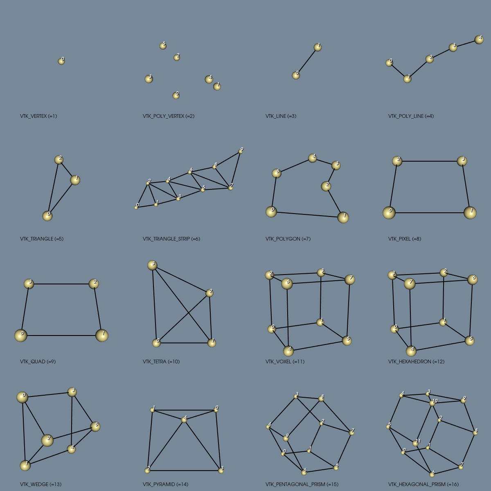
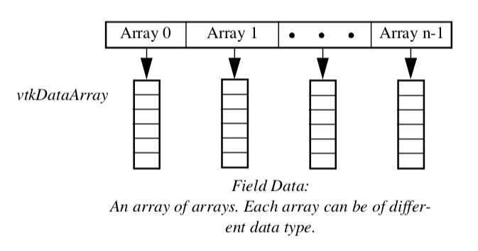

- [VTK](#vtk)
    - [1. Visualization Pipeline](#1-visualization-pipeline)
    - [2. Data representation](#2-data-representation)

## [VTK]
Visualization toolkit - is an open source a C++ library for data visualization. It is also available for use with Python, Java, C#, Javascript and WebAssembly.   
It contains a large collection of algorithm and filter for processsing data.

### 1. Visualization Pipeline
`Process` - transforms data in some way
- **Source** - 0 inputs, >=1 outputs
- **Filter** - >=1 inputs, >=1 outputs
- **Mapper** - >=1 inputs, 0 outputs

**Mappers** are used to connect to the graphics subsytem and are an interface to the VTK's actors.

To process a large dataset, the dataset is required to be
- **Separable** - The data can be broken into pieces
- **Mappable** - An ability to determine what portion of the input data is required to generate a given portion of the output
- **Result invariant** - The results should be independent of the number of pieces and independent of the execution model( single- or multi-threaded )

To satisfy the third requirement, an ability to generate boundary data, or *ghost cells*, is required

`Readers/Writes`
- **Reader** - ingest data from a file, create a data object and the pass the object down the pipeline for processing
- **Writer** - ingest data object and then write the data object to a file.

**Examples**: vtkSTLReader, vtkBYUWriter,

`Importers/Exporters`
- **Importer** - restores an entire scene
- **Exporter** - saves an entire scene

**Examples**: vtk3DSImporter, vtkVRMLExporter,

Filters are devided into two parts : algorithm( `vtkAlgorithm` ) and executive object( `vtkExecutive` ).  
`vtkAlgorithm` - is responsible for processing information  
`vtkExecutive` - is responsible for telling an algorithm when to execute and what information and data to process.

The information and data produced by a filter are stored in one or more **ports**.  
Pipeline related information is stored in `vtkInformation` on each output port. The data for an ouput port is stored in an instance of a class derived from `vtkDataObject`.  

Information and data consumed by a filter are retrieved through one or more input **ports**.

### 2. Data representation

Data can be either *regular*( *structured* ), or irregular( *unstructured* ).
Examples:
- Regular - an evenly spaced set of points. Allows for more compact way of storing
- Irregular - points a spread non-uniformly. An advantage is that it allows to represent information more densely where it changes quickly and less densely where the change is not so great.

**Data object** - a collection of data without any form  
**Data set** - a data object with an organizing *structure* and associated *data attributes*. Data set has two parts:
- *Topology* - set of properties invariant under certain geometric transformations( rotation, translation, nonuniform scaling)
- *Geometry* - instansiation of the topology, the specification of position in 3D space.

*Example*: Saying that a polygon is a "triangle" - specifies topology. Providing point coordinates - specifies geometry.  

Data set assumes the structure consists of *cell* and *points*.
- *Cell* - specifies topology
- *Points* - specifies geometry

#### 2.1 Cell types

Cells are defined by specifying a *type* in combination with an ordered list of points( referred to as *connectivity list*).

    
    Cell types found in VTK

#### 2.2 Data object representation

Data objects in VTK are an array of `vtkDataArrays`.

    
    vtkFieldData

VTK has implemented the following five datasets: `vtkPolyData`, `vtkImageData`, `vtkStructuredData`, `vtkRectilinearGrid` and `vtkUnstructuredGrid`

Links:
- [VTK]
- [User guide]
- [Book]
- [Documentation]
- [Examples]
- [VTK with EGUI demo]

[VTK]: https://docs.vtk.org/en/latest/getting_started/index.html
[User guide]: https://vtk.org/wp-content/uploads/2021/08/VTKUsersGuide.pdf
[Book]: https://book.vtk.org/en/latest/
[Documentation]: https://docs.vtk.org/en/latest/about.html
[Examples]: https://examples.vtk.org/site/
[VTK with EGUI demo]: https://github.com/Gerharddc/vtk-egui-demo/tree/main